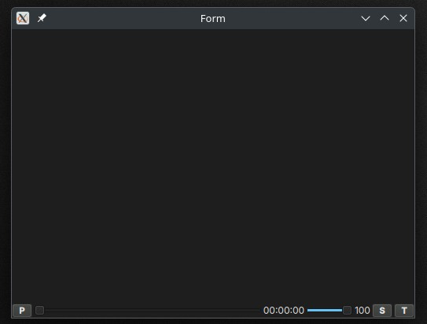

# player p6

video player basico realizado con PySide6
- python 3.13.3
- PySide6==6.9.1

## Notas

- agregando skin
- la fuente de los labels es: `font: 9pt "Monospace";`
- agregado funciones basicas
- el valor maximo del slide de tiempo lo subi de 100 a 500 para que se mueva mas
- corregi el metodo set_vol
- ordene el player
- fix valor del label volumen al mover el slide
- el `timer` se ejecuta solo cuando el player esta reproduciendo video

